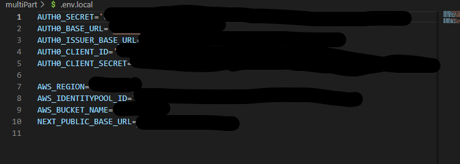

# AWS-NEXT.JS-MULTIPART UPLOADER
---

### Description

This project is built so that a person is able to upload large files to a s3 bucket. It also has an authentication layer built into the web application, that way only those that are intended to use this on a production level are able to, keeping the aws bucket secure. 

When building this project, I chose to use Next.js for the framework, Auth0 for the authentication, and the aws-sdk to work with the aws services that are being called on. I chose Next.js as a framework because of my understanding of React, and the capabilities that Next.js has built into it, such as built-in routes, the separation of client and server side code working together seamlessly. 

Auth0 was the authentication service I used because of its reputation, as well as the documentation it provides and ease of configuration from the site. It provides depth and scaling for whatever the needs are, and is a well-built product that would take much longer to build from scratch. It's also tried and true, so there is that too!

AWS-SDK's toolkit is a no-brainer as far as utilizing it because the whole premise behind this project is to utilize the s3 services to store objects. This was where the true challenge came in, as there was lots of trial and error with getting things to work. It started off with listing files that are in the bucket, and understanding that, to being able to upload a file using a singleObject uploader, and once that was understood, being able to upload files using the multipart uploader. That required trying it many different ways, and rewriting code different ways, watching errors of all sorts, objects not completing the upload, and so forth. 
Much videos, documentation, and trial apps were spun up to get to the point of being able to upload an object this way. The configuration and ability to set up cloudfront, IAM, Identity pools, roles, permissions in buckets, also took time, and overall, building a project like this was completely brand new and a learning process in itself. It was a struggle at times, feeling like I would take 1 step forward and 5 back, and I was ready to throw my computer out the window at least once a day for a month. Overall, though, as I got closer and made progress and persevered to the end, It was rewarding to see it work, and I was glad I saw it through to the end.

# Installation instructions
---
To install this project and use it locally, you will need to run npm install within the main directory of the project to download all dependencies. You will also need to create a .env.local file within that same directory. You'll need that to work with Auth0, and the aws SDK, because there are variables that are used throughout the project that are intended to be kept private.

Here is an example of some of the environment variables you will need in that file:

You will have to set up an aws account and follow instructions to set up the credentials that go along with AWS and Auth0 to get everything up and running from that end.
That will include:

AWS
1. Making a s3 bucket, with folders within the bucket.
2. Creating a cloudfront link.
3. Setting up IAM Policies
4. Attaching a Identity pool

Auth0
1. Having an account
2. following quickstart instructions when initializing an nextjs app
3. obtaining variables for what callback URLS, Logout callbacks, Client ID and secrets are.

Note that the environment variables will work as set up with this project in local instances. To work on a production level, it will require setting up the environment varaibles in whatever way they have to be used based on how it is deployed.

# License
--

MIT License

Copyright (c) [2024] [Korey Hines]

Permission is hereby granted, free of charge, to any person obtaining a copy
of this software and associated documentation files (the "Software"), to deal
in the Software without restriction, including without limitation the rights
to use, copy, modify, merge, publish, distribute, sublicense, and/or sell
copies of the Software, and to permit persons to whom the Software is
furnished to do so, subject to the following conditions:

The above copyright notice and this permission notice shall be included in all
copies or substantial portions of the Software.

THE SOFTWARE IS PROVIDED "AS IS", WITHOUT WARRANTY OF ANY KIND, EXPRESS OR
IMPLIED, INCLUDING BUT NOT LIMITED TO THE WARRANTIES OF MERCHANTABILITY,
FITNESS FOR A PARTICULAR PURPOSE AND NONINFRINGEMENT. IN NO EVENT SHALL THE
AUTHORS OR COPYRIGHT HOLDERS BE LIABLE FOR ANY CLAIM, DAMAGES OR OTHER
LIABILITY, WHETHER IN AN ACTION OF CONTRACT, TORT OR OTHERWISE, ARISING FROM,
OUT OF OR IN CONNECTION WITH THE SOFTWARE OR THE USE OR OTHER DEALINGS IN THE
SOFTWARE.
